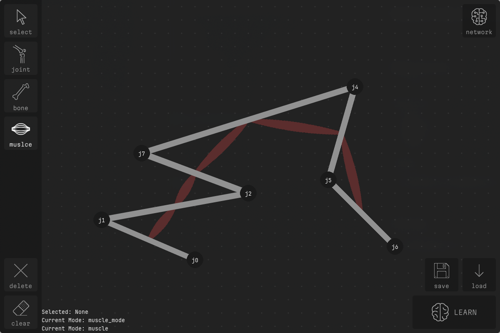
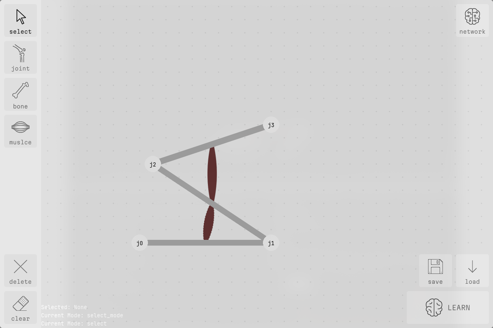
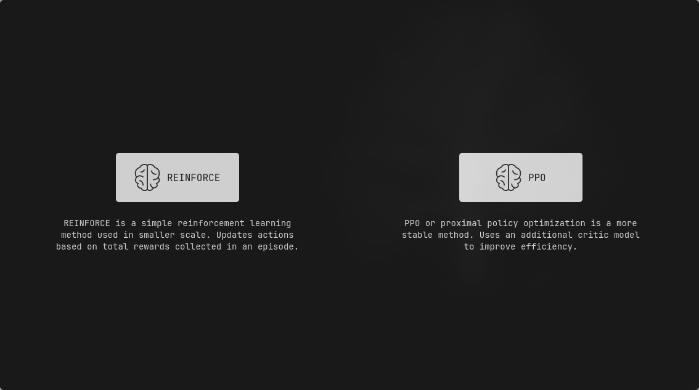
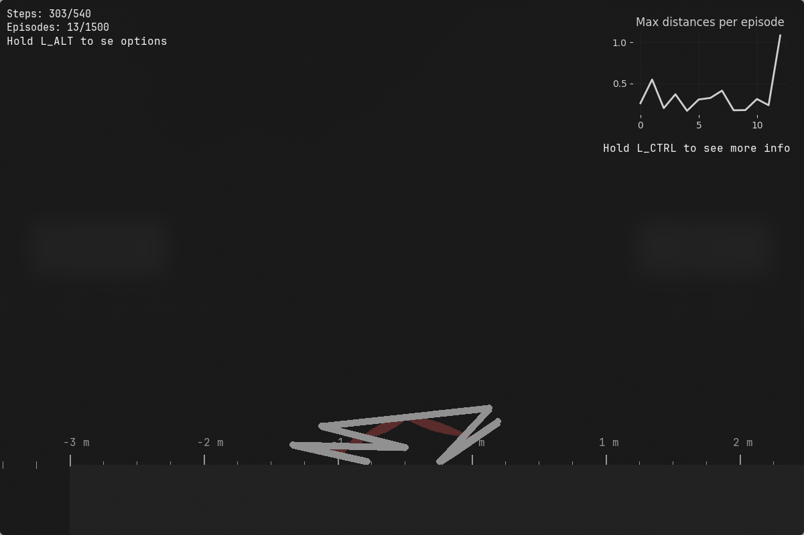
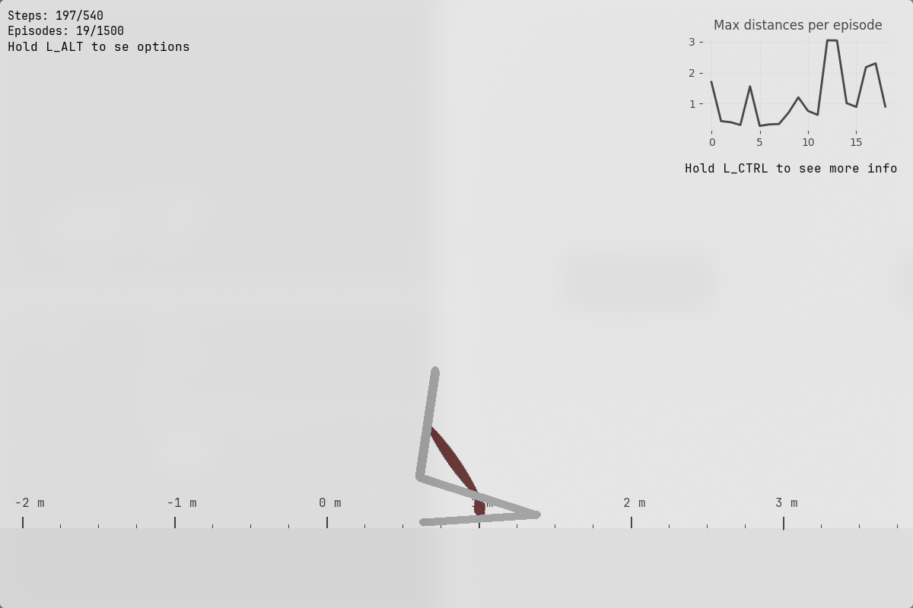
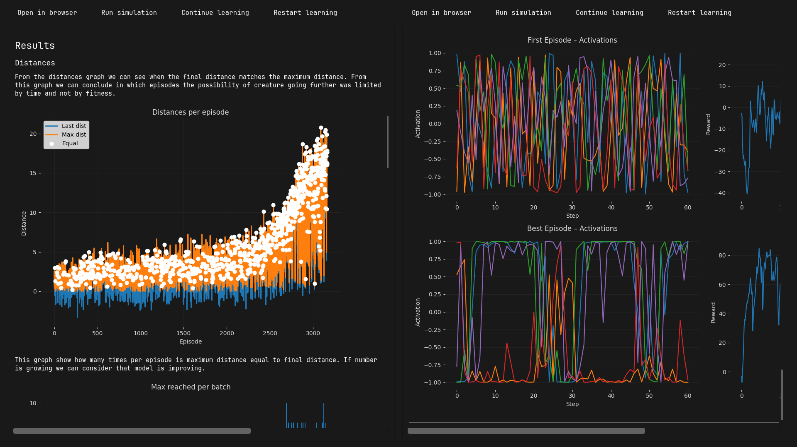

# Reinforcment Learning Simulaton
2D locomotion using pygame with pymunk for physics and torch for rl. 
Inspired by [Evolution - Keiwan Donyagard](https://keiwando.com/evolution/).
App shows difference between REINFORCE and PPO algorithm (with possibility of adding more algorithms)
for same learning environment and nn setup.
---
## Requirements
* `python` ~= 3.13
### Dependencies
* `numpy` ~= 2.4.2
* `matplotlib` ~= 3.10.8
* `pygame-ce` ~= 2.5.6
* `PyQt6` ~= 6.10.2
* `Markdown` ~= 3.10.2
* `torch` ~= 2.10.0

### Installing
```bash
    pip install -r requirements.txt
```


---
## Running 
```bash
    python main.py
```
---

## Results
All results can be found as Markdown files inside creature folder located in `data`/`pretrined`.
Results are grouped by learning algorithm.

Example path: `data/9a2984a8/ppo/summary.md`.

---
## Settings

There is no single endpoint for changing all settings, but almost everything can be edited through these files:

* `src/simulation/simulation_settings.py` changes only apply to new simulations
* `src/ui/ui_settings.py` main editor and training window
* `src/ui/colors.py` change colors
* `src/utils/constants.py` save paths
* `data`/`pretrained`+`{uuid}/{method_name}/settings.json` to change settins of  already trained agent


---
## Screenshots

<details>
<summary> Screenshots</summary>








</details>
