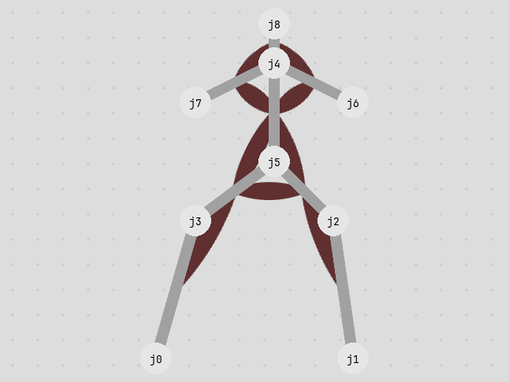
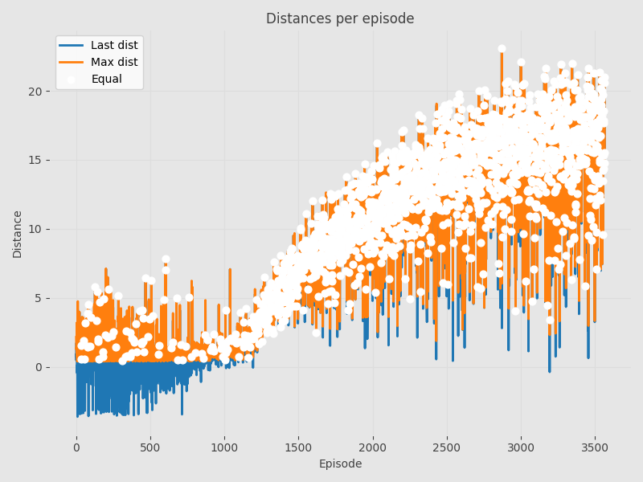
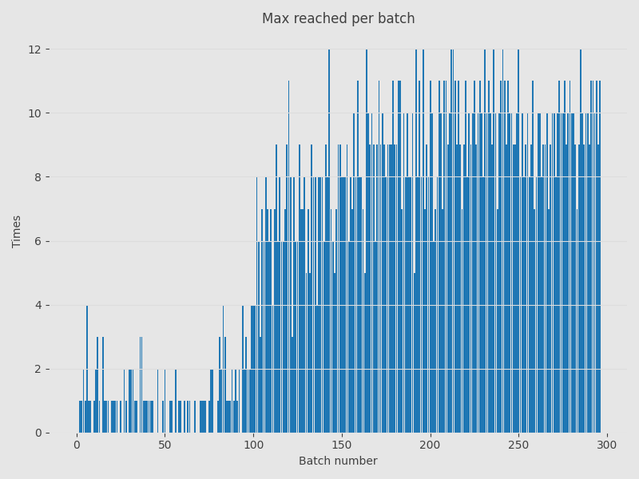
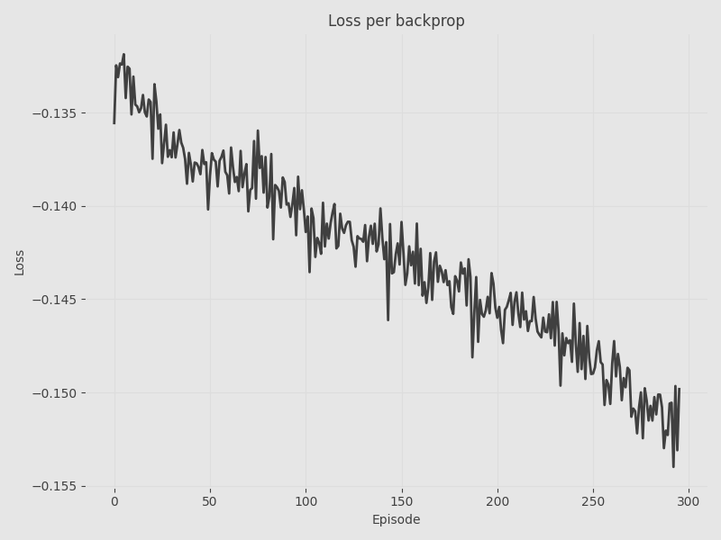
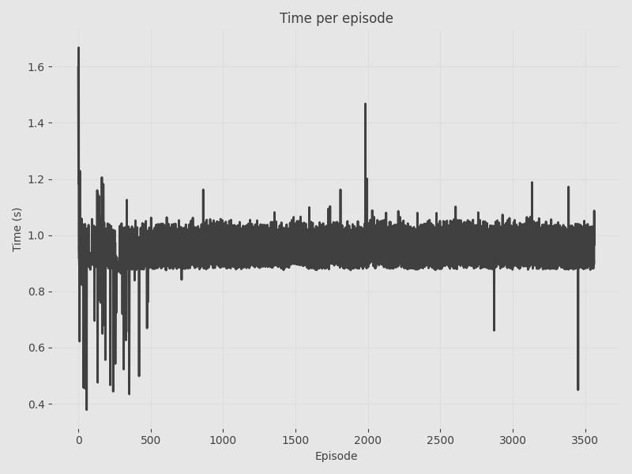
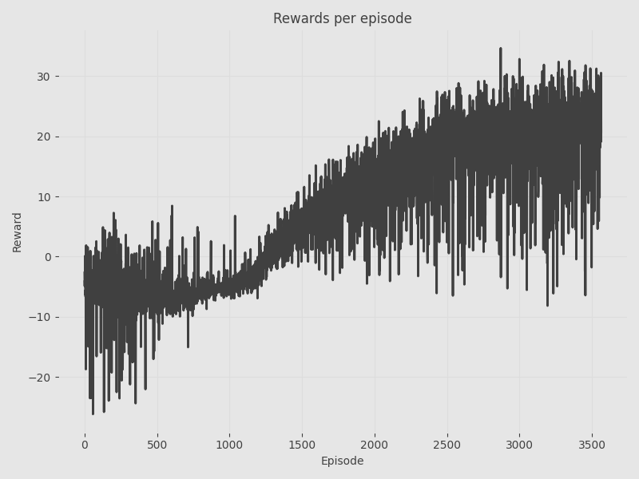
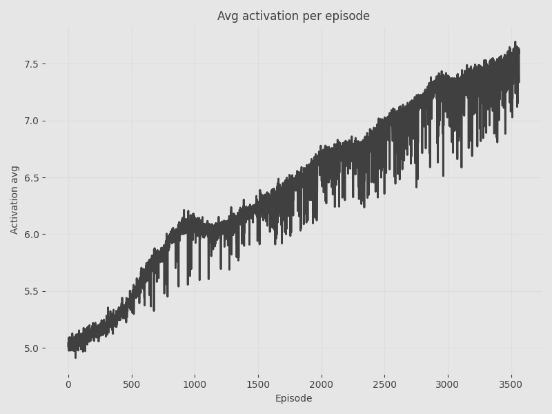
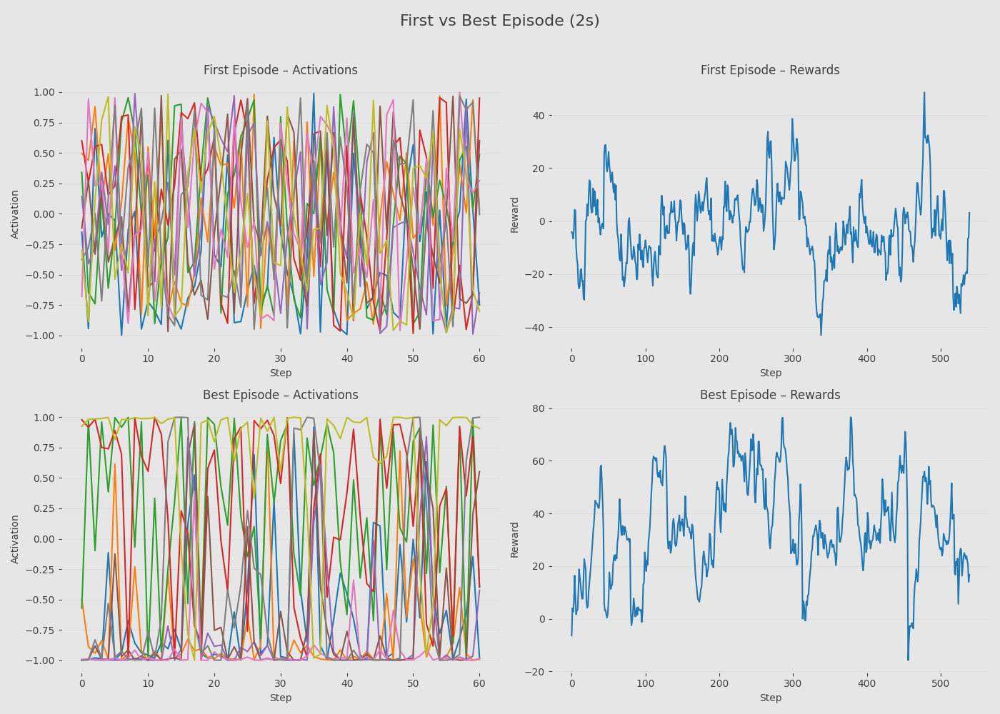

# Reinforcement Learning Simulation Summary

---

## Simulation Information

- **Method :** PPO
- **Date Time:** 23-02-2026 22:21:48
- **Device:** CUDA
- **Physics Timestamp:**  1/60s
- **Physics Substeps:** 30
- **Total Simulation Time:** 00h:54m:12s
- **Number of Steps per Episode:** 540
- **Number of Episodes:** 3565
  

---

## Creature Information

- **Creature ID:** 66b7d989-d8f3-4a0f-bc22-c20eff3cb221
- **Joints:** 9
- **Bones:** 8
- **Muscles:** 9
- **Joint Degrees Min:** 5
- **Joint Degrees Max:** 20
- **Scale:** 15
  

---

## Method Description

Proximal Policy Optimization (PPO) is an on-policy reinforcement learning algorithm that optimizes a clipped surrogate objective to ensure stable policy updates. 
        In this simulation, PPO is used to control muscle activations directly, balancing forward locomotion with energy efficiency through activation penalties.

  
## Network Configuration

- **Method:** Proximal Policy Optimization (PPO)
- **Inputs:** 70
- **Outputs:** 9
### Network Architecture

- **Actor** 
	- Layer Widths: `[70, 30, 30, 30, 9]`
	- Learning Rate: `3e-04`
	- Activation: `Tanh`
	- Optimizer: `Adam`
	- Number of Parameters: `4278`

- **Critic** 
	- Layer Widths: `[70, 30, 30, 30, 1]`
	- Learning Rate: `1e-04`
	- Activation: `Leaky ReLU`
	- Optimizer: `Adam`
	- Number of Parameters: `4021`

### Hyperparameters

- Batch Size: `12`
- Discount Factor: `0.99`
- Clip Epsilon: `0.2`
- K Epochs: `10`
- Entropy Coefficient: `0.01`

  

---

## Results

### Distances

From the distances graph we can see when the final distance matches the maximum distance.
             From this graph we can conclude in which episodes the possibility of creature going further was limited by time and not by fitness.

This graph show how many times per episode is maximum distance equal to final distance. 
            If number is growing we can consider that model is improving.

### Loss per backprop

Main metric for determining success/fitness. Tells us how much agent is improving over time.(Loss is calculated only during backprop)

### Time per episode

Here we can see spikes in time when parameter update is being called and also times when the episode is terminated prematurely.(Letting the simulation run visually will be visible because of the longer time)

### Rewards per episode

Main goal of any method maximize rewards. Per episode average is displayed.

### Activation per episode

Number increases as the muscle is activated more strongly. Per episode average is displayed.

  

---

### Best vs First Episode

|  | **First Episode**  | **Best Episode**  |
| --- | --- | --- |
| **Episode Index**  | 0 | 2871 |
| **Max Distance**  | 2.16m | 23.08m |
| **Last Distance**  | 1.66m | 23.08m |
| **Average Activation**  | 5.01 | 7.34 |
| **Average Rewards**  | -2.66 | 34.67 |
| **Time**  | 00m:01s | <1s |

### Graph Comparison

Activation per neuron and rewards per step.

  

---

## Notes

- This report was generated automatically after simulation completion.
- All conclusions should be made visually by the reader.
- For more information go to the [github repository](https://github.com/ajromen/Reinforcment-Learning-Simulation).
