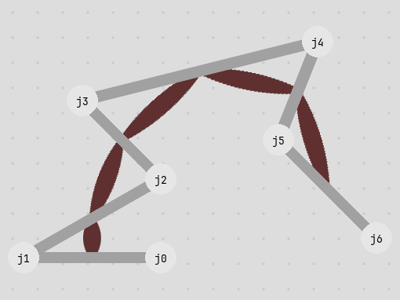
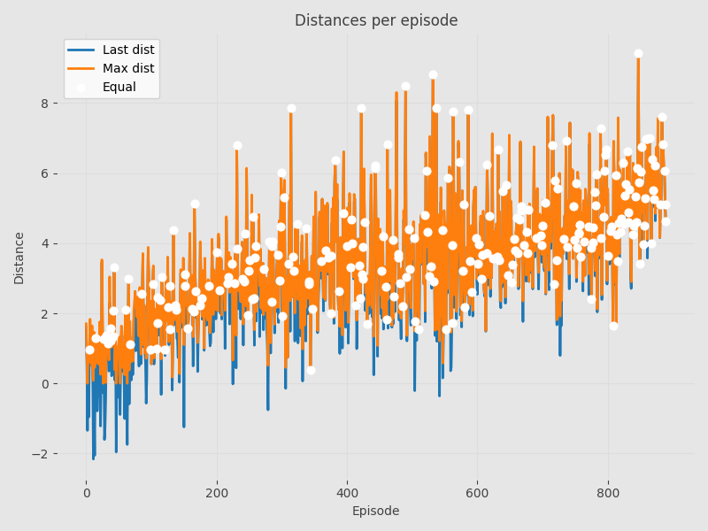
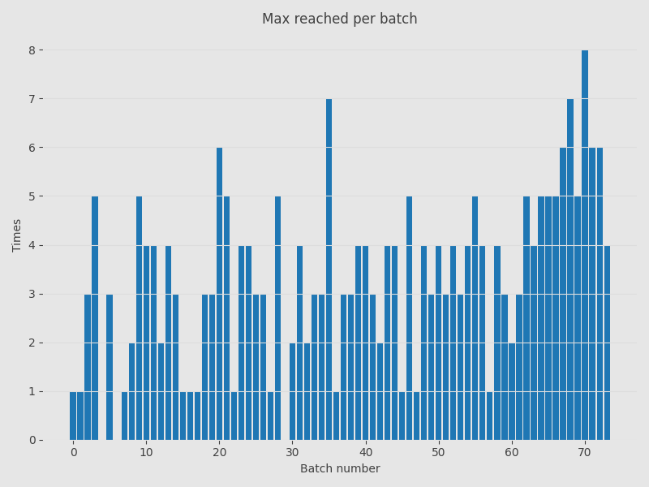
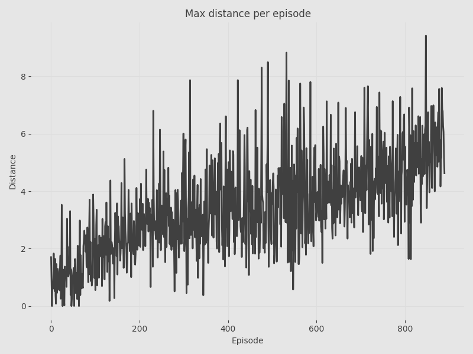
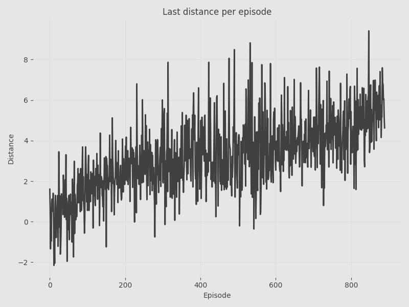
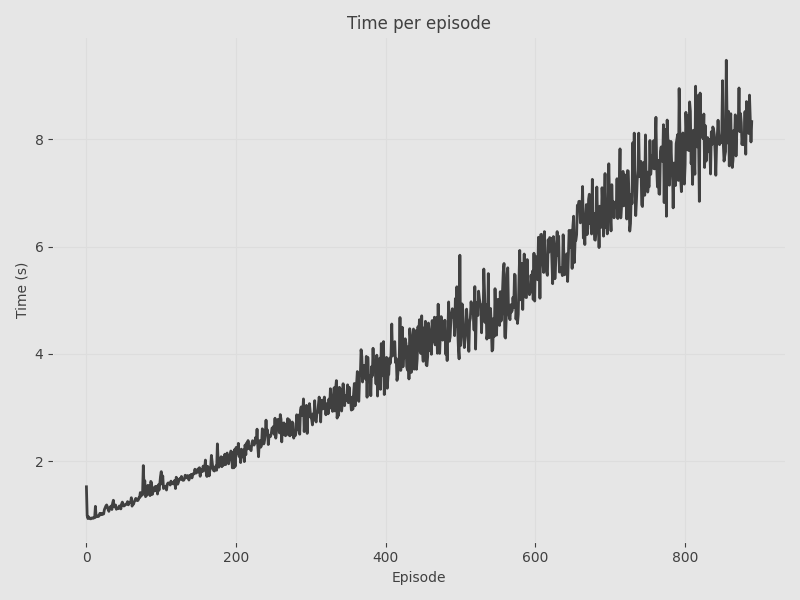
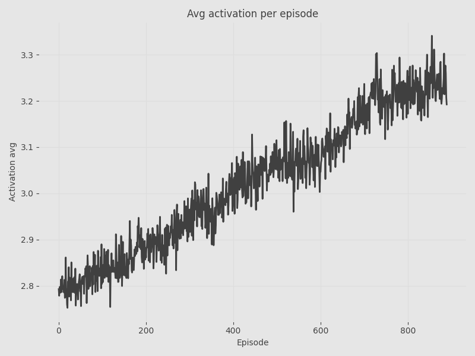
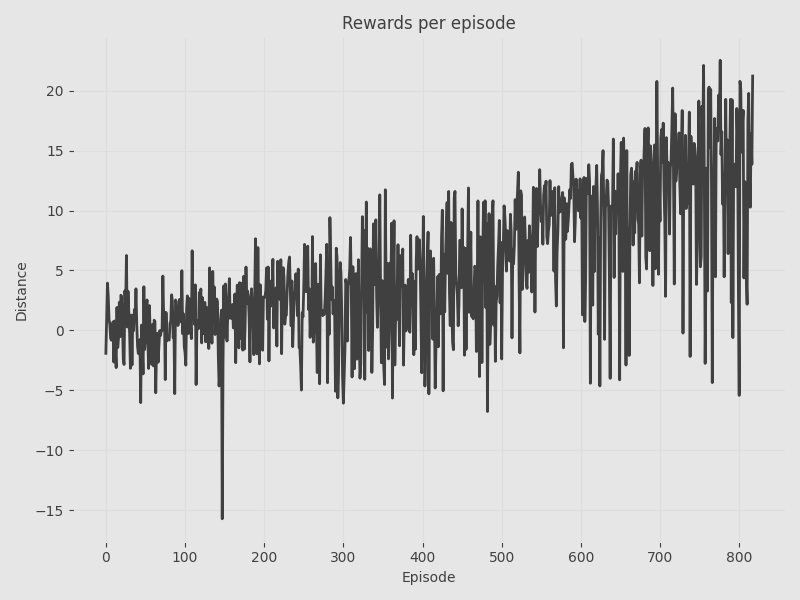

# Reinforcement Learning Simulation Summary

---

## Simulation Information

- **Method :** PPO
- **Date Time:** 08-02-2026 02:23:06
- **Device:** CUDA
- **Physics Timestamp:**  1/60s
- **Physics Substeps:** 30
- **Total Simulation Time:** 00h:46m:13s
- **Number of Steps per Episode:** 540
- **Number of Episodes:** 818
  

---

## Creature Information

- **Creature ID:** f8b0b980-4078-4b8b-a8d1-0aa225940344
- **Joints:** 7
- **Bones:** 6
- **Muscles:** 5
- **Joint Degrees Min:** 5
- **Joint Degrees Max:** 20
- **Scale:** 15
  

---

## Method Description

Proximal Policy Optimization (PPO) is an on-policy reinforcement learning algorithm that optimizes a clipped surrogate objective to ensure stable policy updates. 
        In this simulation, PPO is used to control muscle activations directly, balancing forward locomotion with energy efficiency through activation penalties.

  
## Network Configuration

- **Method:** Proximal Policy Optimization (PPO)
- **Inputs:** 52
- **Outputs:** 5
### Network Architecture

- **Actor** 
	- Layer Widths: `[52, 30, 30, 30, 5]`
	- Learning Rate: `3e-04`
	- Activation: `Tanh`
	- Optimizer: `Adam`
	- Number of Parameters: `3610`

- **Critic** 
	- Layer Widths: `[52, 30, 30, 30, 1]`
	- Learning Rate: `1e-04`
	- Activation: `Leaky ReLU`
	- Optimizer: `Adam`
	- Number of Parameters: `3481`

### Hyperparameters

- Batch Size: `12`
- Discount Factor: `0.99`
- Clip Epsilon: `0.2`
- K Epochs: `10`
- Entropy Coefficient: `0.01`

  

---

## Results

### Distances

From the distances graph we can see when the final distance matches the maximum distance.
             From this graph we can conclude in which episodes the possibility of creature going further was limited by time and not by fitness.

This graph show how many times per episode is maximum distance equal to final distance. 
            If number is growing we can consider that model is improving.

  

---

