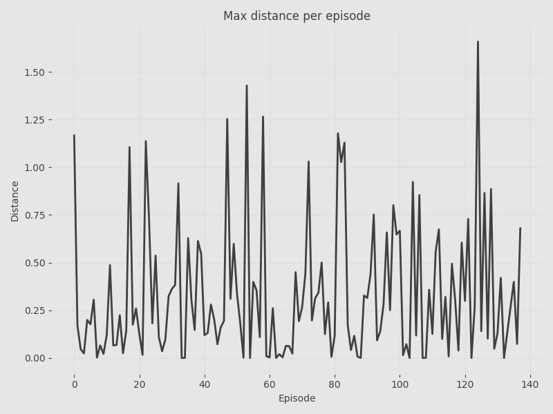
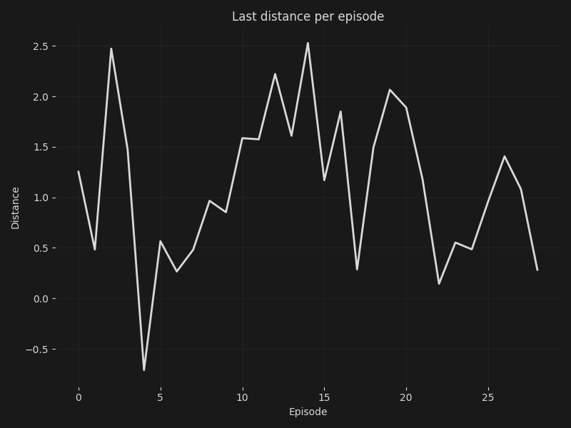

# Reinforcement Learning Simulation Summary

---

## Simulation Information

- **Method :** REINFORCE
- **Date Time:** 08-02-2026 14:46:51
- **Device:** CPU
- **Physics Timestamp:**  1/60s
- **Physics Substeps:** 30
- **Total Simulation Time:** 00h:03m:40s
- **Number of Steps per Episode:** 540
- **Number of Episodes:** 138
  

---

## Creature Information

- **Creature ID:** f8b0b980-4078-4b8b-a8d1-0aa225940344
- **Joints:** 7
- **Bones:** 6
- **Muscles:** 5
- **Joint Degrees Min:** 5
- **Joint Degrees Max:** 20
- **Scale:** 15
  

---

## Method Description

REINFORCE is a policy gradient algorithm that
updates agent policy parameters by increasing the probability of actions that resulted in higher cumulative rewards,
directly maximizing expected returns without needing a value function.

  
## Network Configuration

- **Method:** Vanilla Policy Gradient (REINFORCE)
- **Inputs:** 52
- **Outputs:** 5
### Network Architecture

- **Actor** 
	- Layer Widths: `[52, 30, 30, 30, 5]`
	- Learning Rate: `1e-03`
	- Activation: `Leaky ReLU`
	- Optimizer: `Adam`
	- Number of Parameters: `3610`

### Hyperparameters

- Batch Size: `12`
- Discount Factor: `0.99`

  

---

## Results

### Distances

From the distances graph we can see when the final distance matches the maximum distance.
             From this graph we can conclude in which episodes the possibility of creature going further was limited by time and not by fitness.

This graph show how many times per episode is maximum distance equal to final distance. 
            If number is growing we can consider that model is improving.

  

---

