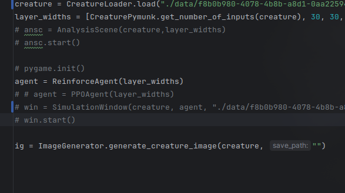

# Deep-Learning-Regression
Implementation of a deep regression model trained with gradient descent variants.
Run different combinations of optimizers and activation functions to graph the results.

---
## Requirements
* `python` ~= 3.13
### Dependencies
* `numpy` ~= 2.4.1
* `matplotlib` ~= 3.10.8
* `pandas` ~= 2.3.3
* `tabulate` ~= 0.9.0

### Installing

```bash
    pip install -r requirements.txt
```

[//]: # (For testing leave `data/test.csv`.)

---
## Running 
```bash
    python main.py
```
## CLI Options
```ignorelang
options:
  -h, --help            show this help message and exit
  -a, --activation {tanh,relu,lrelu,sigmoid,softplus,swish,elu,all}
                        Activation function used in hidden layers (relu - default)
  -o, --optimizer {gradient,adagrad,rmsprop,adam,all}
                        Optimization algorithm used for training (gradient - default)
  -d, --data PATH       Path to input data
  -e, --epochs N        Number of training epochs (full passes over the dataset)
  -bs, --batch-size N   Size of batches
  -l, --layers {shallow,deep,narrow,default,all}
                        Choose from predetermined layers (default - in, 50, 50, out)
  --train-size FLOAT
                        Fraction of data used for training (0.8 = 80%)
  --output-cols N       Number of columns from input data that are used as outputs
  --lr FLOAT            Learning rate
  -v, --verbose BOOL    Verbose output
  --visualise BOOL      Show graphs
```
*note: only one from options, activation and layers can be set to 'all' at a time.

---
## Results
The model generates grid of plots and prints summary to standard output. 


<details>
<summary> Sample result</summary>

```text
> python main.py -o adam -d data/Student_Marks.csv -e 1000 -a all
Epochs: 1000
Data Preview:
┌────┬──────────────────┬──────────────┬─────────┐
│    │   number_courses │   time_study │   Marks │
├────┼──────────────────┼──────────────┼─────────┤
│  0 │                3 │        4.508 │  19.202 │
├────┼──────────────────┼──────────────┼─────────┤
│  1 │                4 │        0.096 │   7.734 │
├────┼──────────────────┼──────────────┼─────────┤
│  2 │                4 │        3.133 │  13.811 │
└────┴──────────────────┴──────────────┴─────────┘

Training Summary:
┌────┬────────────────────────┬───────────────┬──────────────┬───────────────┬─────────────────┐
│    │             Model name │   Loss before │   Loss after │   Improvement │   Training time │
├────┼────────────────────────┼───────────────┼──────────────┼───────────────┼─────────────────┤
│  1 │     adam_tanh_[50, 50] │       768.921 │       719.89 │       49.0307 │           1.60s │
├────┼────────────────────────┼───────────────┼──────────────┼───────────────┼─────────────────┤
│  2 │     adam_relu_[50, 50] │       768.878 │       7.8222 │       761.056 │           1.06s │
├────┼────────────────────────┼───────────────┼──────────────┼───────────────┼─────────────────┤
│  3 │    adam_lrelu_[50, 50] │       768.901 │       7.1715 │        761.73 │           1.19s │
├────┼────────────────────────┼───────────────┼──────────────┼───────────────┼─────────────────┤
│  4 │  adam_sigmoid_[50, 50] │       744.638 │      719.906 │       24.7325 │           1.59s │
├────┼────────────────────────┼───────────────┼──────────────┼───────────────┼─────────────────┤
│  5 │ adam_softplus_[50, 50] │       733.058 │       4.4379 │        728.62 │           1.69s │
├────┼────────────────────────┼───────────────┼──────────────┼───────────────┼─────────────────┤
│  6 │    adam_swish_[50, 50] │         768.9 │        3.779 │       765.121 │           1.71s │
├────┼────────────────────────┼───────────────┼──────────────┼───────────────┼─────────────────┤
│  7 │      adam_elu_[50, 50] │       768.902 │       7.1752 │       761.727 │           1.52s │
└────┴────────────────────────┴───────────────┴──────────────┴───────────────┴─────────────────┘
```
</details>

| Header 1 | Header 2 | Header 3 |
|---|---|---|
| Row 1, Col 1 | Row 1, Col 2 | Row 1, Col 3 |
| Row 2, Col 1 | Row 2, Col 2 | Row 2, Col 3 |



<a href="https://google.com"> link?</a>